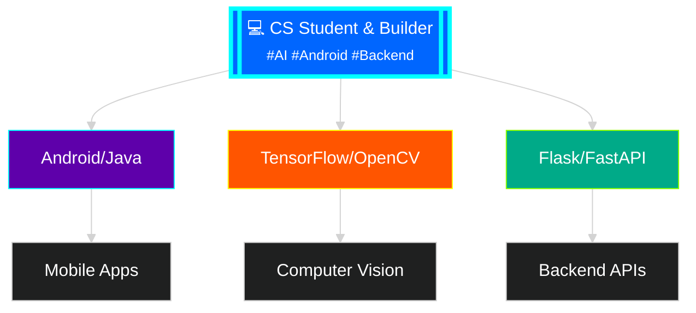

<!-- Animated Gradient Header with Contrast Text -->

<!-- High-Contrast Typing Animation -->

<!-- AI / Neural Network Themed Illustration -->

---

## 🎨 About Me

## 🏆 Focus Areas

## 🛠️ Tech Stack & Skills

<table>
  <tr>
    <td align="center" width="120">
      
       Java
    </td>
    <td align="center" width="120">
      
       Python
    </td>
    <td align="center" width="120">
      
       TensorFlow
    </td>
    <td align="center" width="120">
      
       OpenCV
    </td>
  </tr>
  <tr>
    <td align="center" width="120">
      
       Android
    </td>
    <td align="center" width="120">
      
       Flask
    </td>
    <td align="center" width="120">
      
       Docker
    </td>
    <td align="center" width="120">
      
       Git
    </td>
  </tr>
</table>

## 🚀 Featured Projects

<table>
  <tr>
    <td width="50%">
      

        
          
        <h3>🏥 Medical Management System</h3>
        
<strong>Local native Android app with doctor/patient roles, Room DB, and Retrofit</strong>

         
        
        
        
        
          
        
          
        📱 **Role-Based Architecture**
      

    </td>
    <td width="50%">
      

        
          
        <h3>🔍 Road Crack Detection Pipeline</h3>
        
<strong>Automated digital image processing for road surface crack analysis</strong>

         
        
        
        
          
        
          
        🧠 **Edge Detection & Analysis**
      

    </td>
  </tr>
</table>

## 📌 Currently Working On

- **AI & Deep Learning** - Exploring neural network architectures, object detection with YOLO, and local pipeline integrations with Ollama and n8n
- **Mobile Development** - Refining native Android app structures and backend logic
- **Global Opportunities** - Preparing research portfolios and academic projects ahead of graduation

## 📊 GitHub Stats

## 🤝 Let's Connect

---

